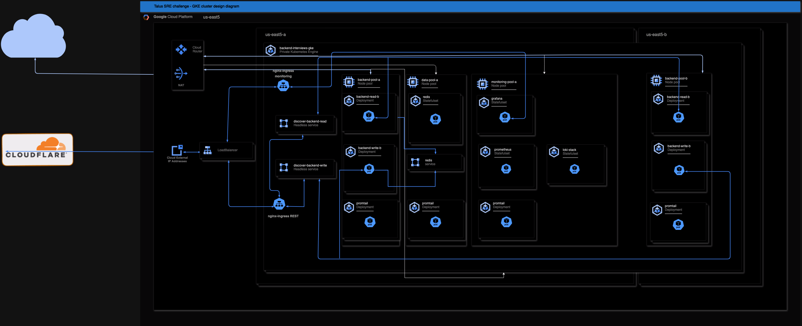

# Solution

## Brief design description

Design consists of a regional GKE private cluster which uses NAT for internet connectivity. The cluster has currently 4 nodepools. One for each AZ of backend service, monitoring and data. Each can be scaled independently by updating the params.json.
Backend pods are separated into READ and WRITE deployments. Each AZ deploys both groups, adding its suffix to the deployment.

There are 2 headless services, backend-read and backend-write. They serve as backend for ingress-rest ingress. There is a separate ingress for monitoring.
Ingress-rest forwards the GET requests to READ and POST requests to WRITE pods. Ingress-monitoring forwards requests to grafana.

Nodepools are deployed with enabled autoscaling. There is also HPA for the backend service pods based on CPU utilization.

## Architecture Diagram



## High Availability

Regional cluster and workload spread over multiple availability zones ensures that service remains up, even when all but one AZ remains operational. See [diagram](./img/Infrastructure-diagram.png) for details.

## Fault Tolerance

Currently there there are 2 READ and 2 WRITE pods. We can lose N-1 AZs and still be able to serve requests.

```bash
    ➜ kubectl get pods -n backend
    NAME                                   READY   STATUS    RESTARTS   AGE
    backend-app-read-a-7fd8484c4c-dqvhz    1/1     Running   0          6m28s
    backend-app-read-b-659d5d8fc5-sw66l    1/1     Running   0          6m28s
    backend-app-write-a-6597b8b7d9-2qn8g   1/1     Running   0          6m28s
    backend-app-write-b-56cc5c7cd7-rfgst   1/1     Running   0          6m28s
```

## Dockerization

There is a docker-compose located in infra/docker. It deploys the core services(backend flaskApp and redis), monitoring(grafana, prometheus, loki, promtail) and logging ELK stack with filebeat. [Traefik](http://localhost:8080/dashboard/#/) is used to loadbalance the web backend service. Redis serves as a key/value
store for the backend services.

To deploy, navigate to the docker folder, first run the build command, then compose up.

```bash
    ➜ cd infra/docker
    ➜ docker compose build
    <omitted>
    ➜ docker compose up -d
     ✔ Network docker_default   Created
     ✔ Container loki           Started
     ✔ Container docker-web-3   Started
     ✔ Container docker-web-1   Started
     ✔ Container docker-web-2   Started
     ✔ Container elasticsearch  Started
     ✔ Container redis          Started
     ✔ Container kibana         Started
     ✔ Container logstash       Started
     ✔ Container promtail       Started
     ✔ Container traefik        Started
     ✔ Container filebeat       Started
     ✔ Container prometheus     Started
     ✔ Container grafana        Started
```

### ELK

For more comprehensive log processing, [Kibana](http://localhost:5601) can be used to visualize data, create Ingest Pipelines, etc. As shown in this picture of discover [view](./img/kibana.png). Filebeat and Logstash are used to forward data to Elastic Search.

### Grafana

Alternatively Grafana, together with Prometheus, Loki and Promtail can be used to achieve similar goal. There are 2 preconfigured [dashboards](./img/grafana-dashboards.png).

Centralized logs from the backend [service](./img/grafana-logs.png) can be viewed thru Logs / App dashboard.
Traffic statistics captured from traefik loadbalancer are available from Traefik [chart](./img/traefik.png)

[hey](https://github.com/rakyll/hey) is used to simulate GET and POST requests.

```bash
    hey -n 100000 -c 10 http://localhost/items
    hey -n 10000 -c 10 -m POST -H "Content-Type: application/json" -d '{"name": "Sample Item"}' http://localhost/items
```

## Infrastructure Provisioning with Terraform

### Setup - How to deploy the infrastructure using Terraform

Terraform configuration is located in infra/terraform. Whole deployment is automated, driven by github actions [Build Image and Deploy Infra](../.github/workflows/build_and_deploy.yaml). This github action deploys either on manual trigger, or after creation of a new tag.

There are few pre requisites for successfull deployment.

- [GCP](https://console.cloud.google.com/) account
- [Terraform Cloud](https://app.terraform.io/public/signup/account) account
- Fork of [repository](https://github.com/tuky191/talus-sre-challenge)
- [Cloudflare](https://dash.cloudflare.com/sign-up) account

#### GCP

- Create new Project
- Create credentials for the terraform cloud user. Navigate to [IAM & Admin/Service](./img/gcp-1.png) Accounts. Create new Service account e.g. [terraform](./img/gcp-2.png), assign it [Owner](./img/gcp-3.png) priviledges.
  Navigate again to Service Accounts and select your newly created [account](./img/gcp-4.png). From there go to [KEYS](./img/gcp-5.png) and create new private key. Make sure to select [JSON](./img/gcp-6.png)
  Download the key to your local. **Important** Use following command to base64 encode it. **Important**

  ```bash
    cat gcp-credential.json | tr -s '\n' ' ' | base64
  ```

- **Important** Enable APIs for [GKE](https://console.cloud.google.com/marketplace/product/google/container.googleapis.com) and [Cloud Resource Manager](https://console.cloud.google.com/apis/library/cloudresourcemanager.googleapis.com) **Important**

#### Terraform Clound

- Create new free [account](https://app.terraform.io/public/signup/account)
- Navigate to your [profile](./img/terraform-1.png)
- Create Terraform API token

#### Cloudflare

- Create new free [Cloudflare](https://dash.cloudflare.com/sign-up) account
- Buy or use a domain you already own
- [Point](./img/cloudflare.png) backend.your-domain and grafana.your-domain to your loadbalancer's IP. You can obtain it from the [Ingress view](./img/gcp-7.png).

#### Github

- Navigate to your profile / Developer settings
- Select Personal access tokens / Tokens (classic)
- Generate new [token](./img/github-1.png)
- Go back to your forked repo and add following repository [secrets](./img/github-2.png) and [variables](./img/github-3.png)

| Secret Name            | Content                        |
| ---------------------- | ------------------------------ |
| GOOGLE_CREDENTIALS     | Base64 encoded gcp credentials |
| GRAFANA_ADMIN_PASSWORD | Admin password for grafana     |
| PAT_TOKEN              | Token for ghcr                 |
| TERRAFORM_CLOUD_TOKEN  | Terraform cloud token          |

| Variable Name               | Content                                                         |
| --------------------------- | --------------------------------------------------------------- |
| TERRAFORM_DOMAIN            | Domain name for accessing backend and grafana from the internet |
| TERRAFORM_GOOGLE_PROJECT    | Name of the GCP project e.g. talus-challenge                    |
| TERRAFORM_GOOGLE_REGION     | Region where GCP deploys resources, e.g. us-east5               |
| TERRAFORM_ORGANIZATION_NAME | Name of terraform organization (created by github action)       |
| TERRAFORM_WORKSPACE_NAME    | Name of terraform workspace (created by github action)          |

- Enable Github actions in the Forked repo
- Run [Build Image and Deploy Infra](./img/github-4.png)

That's it. From now on everything is setup to happen automatically. Github action will create new terraform organization, workspace and variables. Terraform will [deploy](./img/terraform-2.png) all resources to the GCP.
On occasion, in case something fails, you can redeploy by using the **_Deploy Infra_** github action.

## Monitoring and Logging

### Grafana, Prometheus and Loki

The terraform deploys all monitoring resources into the monitoring namespace. Similarly to the docker compose, there preconfigured [dashboards](../infra/terraform/dashboards/) that can be used to monitor backend [performance](../infra/terraform/dashboards/request-handling-performance.json)
or centralized [logging](../infra/terraform/dashboards/loki.json). Kube-prometheus-stack also comes in with many useful charts out of the box.

## Fault tolerance

### Readiness and Liveness probes

Pods are deployed with readiness and liveness probes. I have added a simple healthcheck that, when called, pings the redis kv store. This ensures that data can be stored and retrieved. These probes are also used in the Ingress to send traffic only to healthy nodes.

### Down time handling

With our current setup we can survive N-1 AZ failure. All we need is 1 AZ that's still in operation. For simplicity, and vCPU quota reasons, is redis deployed only to 1 AZ. In real world scenario we would have multi-AZ deployment with replicas, ensuring high availability.

To test we can again utilize hey.

- I have set it to do 1000 POSTs, in 10 threads

```bash
 hey -n 1000 -c 10 -m POST -H "Content-Type: application/json" -d '{"name": "Sample Item"}' https://backend.talus-challenge.uk/items

Summary:
  Total: 13.8088 secs
  Slowest: 0.9673 secs
  Fastest: 0.1188 secs
  Average: 0.1359 secs
  Requests/sec: 72.4175

  Total data: 32820 bytes
  Size/request: 32 bytes

Response time histogram:
  0.119 [1] |
  0.204 [984] |■■■■■■■■■■■■■■■■■■■■■■■■■■■■■■■■■■■■■■■■
  0.289 [5] |
  0.373 [2] |
  0.458 [0] |
  0.543 [0] |
  0.628 [1] |
  0.713 [1] |
  0.798 [1] |
  0.882 [1] |
  0.967 [4] |


Latency distribution:
  10% in 0.1224 secs
  25% in 0.1241 secs
  50% in 0.1267 secs
  75% in 0.1307 secs
  90% in 0.1376 secs
  95% in 0.1533 secs
  99% in 0.3354 secs

Details (average, fastest, slowest):
  DNS+dialup: 0.0003 secs, 0.1188 secs, 0.9673 secs
  DNS-lookup: 0.0000 secs, 0.0000 secs, 0.0032 secs
  req write: 0.0000 secs, 0.0000 secs, 0.0013 secs
  resp wait: 0.1354 secs, 0.1187 secs, 0.9671 secs
  resp read: 0.0001 secs, 0.0000 secs, 0.0019 secs

Status code distribution:
  [201] 990 responses
  [502] 10 responses
```

- While it was running i have delete 1/2 write pods

```bash
➜ kubectl delete pod backend-app-write-a-6597b8b7d9-s4hrt -n backend
pod "backend-app-write-a-6597b8b7d9-s4hrt" deleted
```

Which resulted in 10 failures, which are probably the requests that were being processed during the shutdown.

During the test we saw increased CPU utilization so the hpa for the write deployments scaled the pod number up, and once the surge was gone it scaled them back down.

```bash
➜ kubectl describe hpa backend-app-read-a-autoscaler -n backend
Name:                                                  backend-app-read-a-autoscaler
Namespace:                                             backend
Labels:                                                <none>
Annotations:                                           <none>
CreationTimestamp:                                     Tue, 17 Sep 2024 23:16:26 +0200
Reference:                                             Deployment/backend-app-read-a
Metrics:                                               ( current / target )
  resource cpu on pods  (as a percentage of request):  2% (1m) / 80%
Min replicas:                                          1
Max replicas:                                          3
Behavior:
  Scale Up:
    Stabilization Window: 0 seconds
    Select Policy: Max
    Policies:
      - Type: Pods     Value: 4    Period: 15 seconds
      - Type: Percent  Value: 100  Period: 15 seconds
  Scale Down:
    Select Policy: Max
    Policies:
      - Type: Percent  Value: 100  Period: 15 seconds
Deployment pods:       1 current / 1 desired
Conditions:
  Type            Status  Reason              Message
  ----            ------  ------              -------
  AbleToScale     True    ReadyForNewScale    recommended size matches current size
  ScalingActive   True    ValidMetricFound    the HPA was able to successfully calculate a replica count from cpu resource utilization (percentage of request)
  ScalingLimited  False   DesiredWithinRange  the desired count is within the acceptable range
Events:
  Type     Reason                   Age                From                       Message
  ----     ------                   ----               ----                       -------
  Warning  FailedGetResourceMetric  22m (x6 over 22m)  horizontal-pod-autoscaler  No recommendation
  Normal   SuccessfulRescale        17m                horizontal-pod-autoscaler  New size: 2; reason: cpu resource utilization (percentage of request) above target
  Normal   SuccessfulRescale        17m                horizontal-pod-autoscaler  New size: 3; reason: cpu resource utilization (percentage of request) above target
  Normal   SuccessfulRescale        11m                horizontal-pod-autoscaler  New size: 2; reason: cpu resource utilization (percentage of request) below target
  Normal   SuccessfulRescale        11m                horizontal-pod-autoscaler  New size: 1; reason: cpu resource utilization (percentage of request) below target
```

### Optional Enhancements

#### CI/CD pipeline

All actions are driven from Github. All that needs to be provided are the variables and secrets, everything else happens automatically, including setting up the monitoring and logging.

#### Network policies and RBAC

GKE cluster is using new DataplaneV2 so that means that the network [policies](../infra/terraform/firewall.tf) are enabled by default. Below is an example of firewall segmentation. All Namespaces
have an Ingress network policy that dictates what is allowed. Anything else not explicitly listed is denied.

```bash
➜ kubectl get networkpolicy allow-ingress-to-monitoring -n monitoring -o yaml
    apiVersion: networking.k8s.io/v1
    kind: NetworkPolicy
    metadata:
    creationTimestamp: "2024-09-17T21:15:30Z"
    generation: 1
    name: allow-ingress-to-monitoring
    namespace: monitoring
    resourceVersion: "2437"
    uid: e1d540ba-202f-42bc-ab35-3dc72122b73a
    spec:
    ingress:
    - from:
        - namespaceSelector:
            matchLabels:
            kubernetes.io/metadata.name: ingress-nginx
        ports:
        - port: 3000
        protocol: TCP
    - from:
        - namespaceSelector:
            matchLabels:
            kubernetes.io/metadata.name: monitoring
        ports:
        - port: 3100
        protocol: TCP
    - from:
        - ipBlock:
            cidr: 0.0.0.0/0
        ports:
        - port: 9090
        protocol: TCP
    podSelector: {}
    policyTypes:
    - Ingress
```

Loki is set to be accessible only from monitoring namespace.

```bash
    kube-prometheus-stack-grafana-0:/usr/share/grafana$ curl loki-stack.monitoring.svc.cluster.local:3100
    404 page not found
```

Trying to access it from backend namespace results in timeout.

```bash
root@backend-app-read-a-7fd8484c4c-kngk9:/app# curl loki-stack.monitoring.svc.cluster.local:3100 -v
- Trying 10.0.35.16:3100...
```
